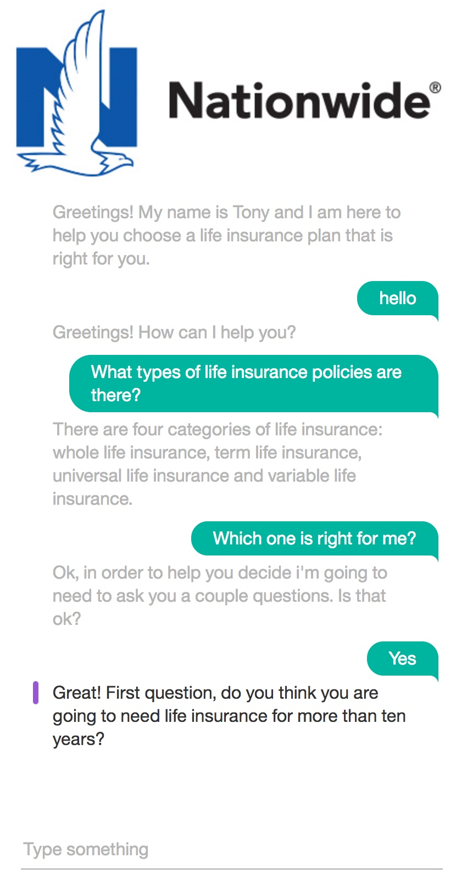

# Nationwide Insurance Chatbot
This node.js application uses IBM Watson conversation service to assist Nationwide customers in choosing a life Insurance plan. This application allows the customer to have a natural converation with a chatbot.  

<p align="center">

</p>

A live demo of this app can be seen [here](https://life-insurance-web.mybluemix.net/).

## Installation Instructions
### Install Node and NPM
If you don't already have Node or NPM installed, [follow these instructions](https://docs.npmjs.com/getting-started/installing-node).
### Getting the files
Use GitHub to clone the repository locally, or [download the .zip file](https://github.com/thomasdail/ChatBot/archive/master.zip) of the repository and extract the files.   
1. Install the app package into the local Node.js runtime environment:

    ```bash
    npm install
    ```

1. Start the app:

    ```bash
    npm start
    ```

1. Point your browser to http://localhost:3000 to try out the app.
